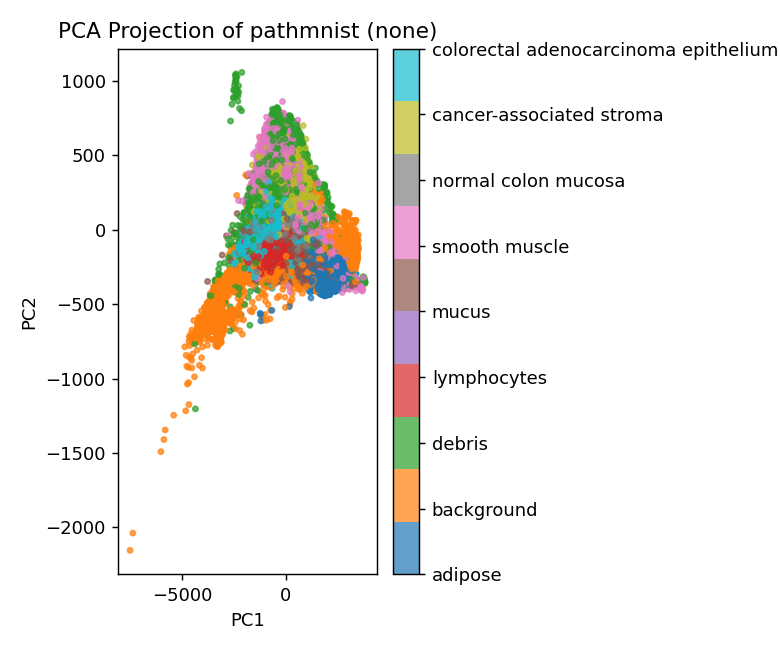
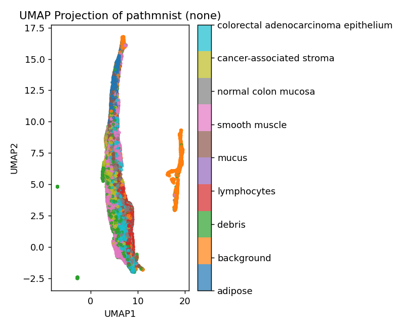
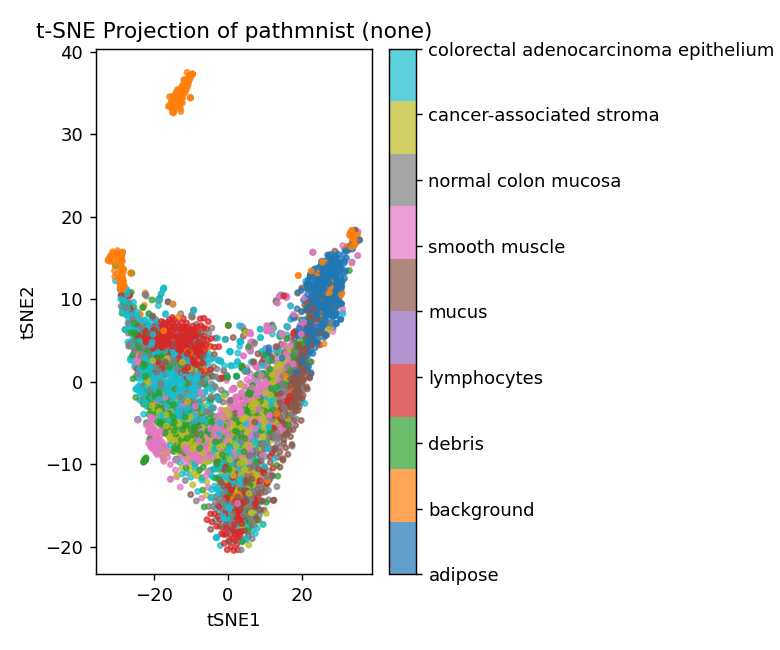

# Dimension Reduction Report 1 — `pathmnist`

**Dataset:** `data/pathmnist/` (MedMNIST v2 PathMNIST, colon pathology patches, train split)

## 1. Dataset summary

Each sample is a 28 × 28 RGB tissue patch flattened to 2,352 raw pixel intensities (`DATA.md`). `inspect_data.py` (`outputs/pathmnist/profile.json`) confirmed the characteristics `DATA.md` said to check:

| Property | Value | What it means |
|---|---|---|
| `n_samples` × `n_features` | 89,996 × 2,352 | Large n. Methods that build a dense n × n matrix (MDS, Kernel PCA, Isomap) are infeasible at full size (~65 GB for that matrix alone) |
| `sparsity_fraction` | 0.00015 | Dense. Almost no exact zeros, as `DATA.md` expected |
| `value_range` | 0 – 255 | Raw 8-bit intensities with no normalization |
| `feature_scale_ratio_max_over_min_std` | 1.47 | Pixel standard deviations are nearly uniform |
| `n_constant_columns` / `missing_fraction` | 0 / 0.0 | Nothing to drop or impute |
| `rank_estimate_from_svd` | `null` | The tool skipped it because n × p ≈ 212M is above its size limit |

Because the rank estimate was skipped, I computed a variance spectrum from a 50-component PCA run (`outputs/pathmnist/pca_none_50`). I divided the variance of each score column by the total pixel variance:

- **PC1 = 54.6%**, PC2 = 2.3% (PC1–2 = 56.9%)
- 10 PCs = 66.8%, 20 PCs = 71.9%, 50 PCs = 79.1%
- The count needed for 90% of variance is **well above 50**

The spectrum has one dominant direction followed by a long, slowly decaying tail. As a diagnostic check (not a DR input), I correlated PC1 scores with each image's mean pixel intensity and got **|r| = 0.999**. PC1 is therefore almost exactly **overall patch brightness/stain density**. The remaining variance is spread thinly across many directions, which is what you'd expect for texture: neighboring pixels are correlated, but the pattern shifts position from patch to patch, so no small set of fixed pixel directions captures it.

The labels `y` are **9 tissue classes**, roughly balanced (7,886 to 12,885 per class): adipose, background, debris, lymphocytes, mucus, smooth muscle, normal colon mucosa, cancer-associated stroma, and colorectal adenocarcinoma epithelium. I used them **only** for plot coloring and silhouette evaluation, never as a DR input. `DATA.md` points to **discrete tissue classes** as the structure worth recovering. Per-class mean brightness differs noticeably only for adipose (207.6) and background (142.3, SD 50.9). The other seven classes all fall between 157 and 181, with overlapping spreads. That suggests brightness alone will separate only a few classes.

## 2. Preprocessing decision: `none`

I followed the preprocessing skill:

- **No log transform.** The data are not sparse counts (sparsity 0.00015), and intensities are bounded in [0, 255] without a heavy right tail. The rationale for `log1p` (right-skewed counts dominated by a few high-expression features) doesn't apply here.
- **No standardization.** The skill says that when all features share one physical unit, like pixel intensities in [0, 255], standardizing is "a real choice with tradeoffs, not a default." The scale ratio is only 1.47, so no pixel dominates distances because of its units. Z-scoring would mostly inflate the weight of low-variance border pixels relative to the center. It would also not remove the dominant brightness effect, which varies *per image*, not per pixel. Keeping the raw scale makes Euclidean distance mean "difference in pixel intensity," which is easy to interpret.
- **Nothing to drop or impute** (0 constant columns, 0 missing values).

All runs below record `"preprocessing": "none"` in `run_config.json`, and `evaluate.py` was called with `--preprocessing none` to match.

## 3. Methods selected

I followed the method-selection skill's criteria:

1. **PCA (baseline, full n = 89,996).** The skill says to always run it first. It is also the reference that the silhouette gaps of the other methods are compared against. The spectrum above (one direction explains 55%, then 90% needs more than 50 PCs) says a linear method will capture the dominant brightness axis but probably not the class structure.
2. **UMAP (full n = 89,996).** The structure `DATA.md` expects is discrete tissue classes, and the linear spectrum stays high after PC1. The skill's recommendation for "visualizing discrete groups" is t-SNE or UMAP, and UMAP uses a sparse k-NN graph, so it scales to 90k samples without subsampling. **`n_neighbors = 30`** (above the default 15): with about 10,000 patches per class, a somewhat larger neighborhood lets class-level organization shape the layout instead of fine within-class texture. I kept `min_dist = 0.1` (default) and fixed the seed with `random_state = 0`.
3. **t-SNE (subsample n = 5,000, seed 0).** This is a second visualization method with a different objective (pure local-neighborhood matching, no attempt at larger-scale layout). It lets me check whether any class structure UMAP shows or misses is method-specific. The skill notes that t-SNE is much slower than PCA/UMAP at this scale, so I **subsampled to 5,000 rows** (`--subsample 5000 --seed 0`). I sized that from complexity, per the skill's 2,000–5,000 guidance, and it matches `evaluate.py`'s default 5,000-point metric subsample. I used perplexity 30 and PCA initialization.

**Not run, and why:**
- **MDS / Kernel PCA / Isomap**: infeasible at full n (dense n × n matrix). Classical MDS on Euclidean distances would also just reproduce PCA.
- **LLE / Laplacian Eigenmaps / Diffusion Map**: `DATA.md` describes discrete classes, not a smooth manifold or trajectory, so these are not the natural fit. Graph methods would also inherit the same raw-pixel k-NN graph as UMAP (see the conclusion for why that graph is the real bottleneck).

## 4. Results

All metrics are from `evaluate.py`. Trustworthiness uses k = 15 on a 5,000-point subsample (`trustworthiness_n_points` = 5,000). The silhouettes also use 5,000 points (`silhouette_n_points` = 5,000). The input-space silhouette is computed in the raw 2,352-dimensional pixel space, and it comes out identical (−0.044) across all three runs, so the same rows were evaluated each time.

### 4.1 PCA

**Hyperparameters** (`outputs/pathmnist/pca_none_2d/run_config.json`): `method: pca`, `n_components: 2`, `preprocessing: none`, `params: {}`, no subsample.

| Trustworthiness | Silhouette (embedding) | Silhouette (input) | Gap |
|---|---|---|---|
| 0.801 | −0.058 | −0.044 | **−0.015** |

**Interpretation.** PC1–2 explain 56.9% of pixel variance, almost all of it on PC1, which is mean brightness (|r| = 0.999).
- **What PCA shows:** adipose (bright, right) and background (dark, far left, with a long tail) sit at the extremes of PC1. The other seven classes overlap heavily in the middle. Because PCA is linear, those between-group positions can be read as real brightness differences, within the 57% of variance shown.
- **Class separation:** the silhouette is negative both in the input space and in the embedding. Under raw Euclidean pixel distance, a patch's nearest same-class patches are on average *not* closer than patches of other classes.
- **Local fidelity:** trustworthiness of 0.80 is acceptable for a linear 2-D projection.
- **Baseline gap:** −0.015 is the reference for the next two methods.

### 4.2 UMAP

**Hyperparameters** (`outputs/pathmnist/umap_none_nn30/run_config.json`): `method: umap`, `n_components: 2`, `preprocessing: none`, `params: {"n_neighbors": 30, "min_dist": 0.1, "random_state": 0}`, no subsample.

| Trustworthiness | Silhouette (embedding) | Silhouette (input) | Gap |
|---|---|---|---|
| 0.812 | −0.056 | −0.044 | **−0.013** |

**Interpretation.**
- **Layout:** UMAP places most patches along one long, thin curve, plus a detached group made mostly of background patches and two small debris islands. Position along the main curve is strongly associated with brightness (|r| ≈ 0.74 with each axis). So even with a nonlinear neighborhood method, the dominant organization is the same brightness continuum PCA found.
- **Local fidelity:** trustworthiness improves only slightly over PCA (0.812 vs 0.801).
- **Class separation:** the gap (−0.013) is essentially PCA's (−0.015). UMAP does **not** add apparent class separation beyond what a linear projection shows. That rules out the usual concern that the separation is created by the method, but it also means UMAP recovers little class structure from raw pixels.
- **Wording:** some patches of the same class (e.g. adipose near the top, lymphocytes near the bottom) are placed in the same neighborhood of the curve, but the classes are interleaved along it. Following the evaluation skill, I don't interpret the distance to the detached background group or the sizes of the groups.

### 4.3 t-SNE (5,000-patch subsample)

**Hyperparameters** (`outputs/pathmnist/tsne_none_p30_sub5000/run_config.json`): `method: tsne`, `n_components: 2`, `preprocessing: none`, `params: {"perplexity": 30, "random_state": 0, "init": "pca"}`, `subsample: {"n": 5000, "seed": 0}`.

| Trustworthiness | Silhouette (embedding) | Silhouette (input) | Gap |
|---|---|---|---|
| **0.831** (highest) | −0.066 | −0.044 | **−0.022** |

**Interpretation.**
- **Local fidelity:** t-SNE has the highest trustworthiness (0.831), so it preserves raw-pixel nearest neighbors best of the three. Its trustworthiness and silhouette are computed within the 5,000-point subsample, not within all 89,996 patches, so the neighborhoods are coarser and the comparison with PCA/UMAP is approximate.
- **Layout:** the horizontal axis again tracks brightness (|r| = 0.89 with tSNE1): adipose sits at one end and background at the other, with one tight background group apart from the rest.
- **Class separation:** lymphocytes gather in two local neighborhoods, but the remaining classes are interleaved. The gap (−0.022) is no larger than PCA's, so t-SNE also finds no class structure that the linear projection misses.
- **Caveats:** the method adds no apparent separation. As with UMAP, I don't interpret between-group distances or group sizes.

### 4.4 Side-by-side

| Run | n embedded | Trustworthiness | Silhouette (emb.) | Gap vs input | Gap vs PCA gap |
|---|---|---|---|---|---|
| PCA | 89,996 | 0.801 | −0.058 | −0.015 | — |
| UMAP (nn = 30) | 89,996 | 0.812 | −0.056 | −0.013 | ≈ same |
| t-SNE (perp. 30) | 5,000 | 0.831 | −0.066 | −0.022 | ≈ same (slightly lower) |

## 5. Conclusion

**Recommendation: UMAP (n_neighbors = 30) as the working visualization, always read alongside PCA.**
- UMAP embeds all 89,996 patches without subsampling, and its local fidelity (0.81) is on par with the alternatives.
- Its silhouette gap matches PCA's, so it does not exaggerate class structure.
- t-SNE has slightly higher trustworthiness, but only on a 5,000-patch subsample, and it shows the same qualitative picture.
- PCA remains essential: it is the only one of the three where the main axis has a direct, checkable meaning (PC1 = brightness, 54.6% of variance).

**Main finding and caveats:**
- **Raw pixel geometry does not organize these patches by tissue class.** The input-space silhouette is negative (−0.044), and none of the three methods, linear or nonlinear, produces a positive silhouette. Every method's leading structure is overall brightness/stain density, which separates only adipose and background from the other seven classes. This is not a failure of any one DR method: the Euclidean distance on flattened pixels that they all start from mainly measures brightness.
- **This confirms the spatial concern in `DATA.md`.** Flattening discards the spatial arrangement of pixels, so two patches with the same texture shifted by a few pixels look far apart. Tissue class is carried by texture and morphology, which pixel-wise distance cannot capture.
- **Unmet goal:** a 2-D map in which the nine tissue classes occupy distinct neighborhoods. Recovering that would need a representation that respects spatial structure before DR, such as CNN features (e.g. a pretrained ResNet embedding) or other translation-invariant texture descriptors. Per-image brightness normalization (dividing each patch by its mean) would also be worth trying to remove the PC1 nuisance axis. None of these are available in `run_dr.py`'s preprocessing options, so they are recommended extensions, not something I ran.
- **Subsampling:** t-SNE was run on a 5,000-patch uniform subsample (seed 0). PCA and UMAP used the full dataset. All metrics were computed on 5,000-point evaluation subsamples.
- **Seeds:** UMAP and t-SNE results depend on `random_state = 0`. Other seeds will change the exact layout, though I would expect the same overall brightness-dominated organization.
