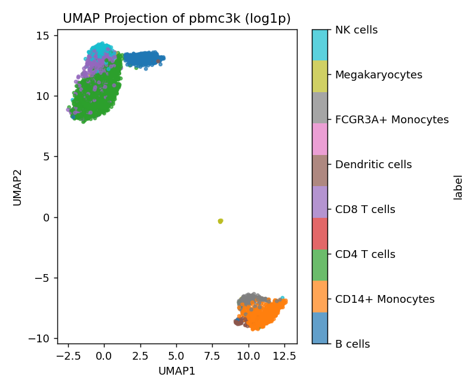

# Dimension Reduction Report 2 — `pbmc3k`

**Dataset:** `data/pbmc3k/` (10x Genomics PBMC 3k, via scanpy)

## 1. Dataset summary

The matrix holds **2,638 cells × 16,579 genes** of raw UMI counts: no normalization, log transform or scaling has been applied (`DATA.md`). `inspect_data.py` (`outputs/pbmc3k/profile.json`) confirmed what `DATA.md` said to expect:

| Property | Value | What it means |
|---|---|---|
| `sparsity_fraction` | 0.949 | About 95% of entries are zero, which is typical of droplet scRNA-seq |
| `value_range` | 0 – 419 | Integer counts with a long right tail |
| `feature_scale_ratio_max_over_min_std` | 2,321 | Gene standard deviations differ by more than three orders of magnitude |
| `n_constant_columns` | 0 | Nothing to drop |
| `missing_fraction` | 0.0 | No imputation needed |
| `rank_estimate_from_svd` | `null` | The tool skipped it because n × p ≈ 43.7M is above its 5M-cell limit |

Because the tool's rank estimate was skipped, I got a variance spectrum from the tool's own output instead. I ran a 50-component PCA (`outputs/pbmc3k/pca_log1p_50`) and divided the variance of each score column by the total variance of the log1p data:

- PC1 = 9.1%, PC2 = 6.2% (so **PC1–2 = 15.3%**)
- 10 PCs = 21.2%
- 50 PCs = 26.5%

The spectrum has a sharp elbow near 10 PCs followed by a long, flat tail. The biological signal is concentrated in a few linear directions, and most of the total variance is spread across thousands of weak, noise-like gene directions. So the "90% variance" dimension count is very high (far above 50). Here that reflects technical noise more than intrinsic nonlinear dimensionality.

The labels `y` come from scanpy's community PBMC3k tutorial annotation and cover **8 cell types** with very uneven sizes: CD4 T 1,144; CD14+ Mono 480; B 342; CD8 T 316; NK 154; FCGR3A+ Mono 150; Dendritic 37; Megakaryocytes 15. I used them **only** for post-hoc coloring and silhouette scores, never as a DR input. The structure to expect is therefore **discrete cell populations of very different abundance**, with some closely related subtypes (CD4 vs CD8 T, CD14+ vs FCGR3A+ monocytes), rather than a continuous trajectory.

## 2. Preprocessing decision: `log1p`

I followed the preprocessing skill:

- **High sparsity with a wide value range (0.949, 0–419) → log transform.** In raw counts, a few highly expressed genes dominate Euclidean distance. `log1p` compresses that tail, which is the standard choice for count data.
- **Why not `log1p_standardize`, even with a scale ratio of 2,321?** The skill notes that standardizing is a trade-off, not a default. Here it would give each of the 16,579 genes unit variance, including thousands of genes detected in only a handful of cells. Those near-constant genes are mostly sampling noise; after z-scoring, a single nonzero count becomes an extreme outlier with equal weight to a real marker gene. In a normal scRNA-seq pipeline, scaling is only safe after selecting highly variable genes, and `run_dr.py` has no gene-selection option. Keeping the log scale lets higher-variance (more informative) genes carry more weight.
- `run_config.json` records `"preprocessing": "log1p"` for every run below, and `evaluate.py` used the same mode for its input-space silhouette.

**Known limitation: no per-cell library-size normalization.** `run_dr.py` offers only `none / standardize / log1p / log1p_standardize`, and none of them performs per-cell depth normalization (the usual `normalize_total` step before log1p). Cell library sizes range from 561 to 8,931 UMIs (median 2,214). I checked the effect post hoc on the PCA scores:

- PC1 correlates **0.77 with log library size** and **0.84 with the number of genes detected**.
- PC2 correlates −0.60 with log library size.

So part of the leading variance is sequencing depth, not biology. Section 5 discusses how this affects the conclusions. I did not change the tools, since they must stay dataset-agnostic and the task constrains me to the supported modes.

## 3. Method selection

I followed the method-selection skill's decision guidance:

1. **PCA (always first, baseline).** It is cheap and deterministic. Its silhouette gap is the reference point the evaluation skill requires for judging t-SNE and UMAP. The spectrum above (elbow at ~10 PCs) suggests a linear method captures the main axes but will not resolve 8 populations in only 2 dimensions.
2. **t-SNE (perplexity 30).** `DATA.md` describes *discrete* cell types, and the skill's table maps "2-D visualization of local neighborhoods and group separation" to t-SNE. With n = 2,638, Barnes–Hut t-SNE is cheap, so no subsampling was needed. I kept perplexity at 30 because the smallest groups have 15–37 cells; a much larger perplexity would blend the rare megakaryocyte and dendritic-cell groups into their neighbors.
3. **UMAP (n_neighbors 30, min_dist 0.3).** The skill describes UMAP as local structure "plus some larger-scale layout". I wanted to see whether the lymphoid versus myeloid arrangement survives. I raised `n_neighbors` from the default 15 to 30 so that broader relationships shape the layout. It still stays below the size of every group except the two rare ones. I raised `min_dist` to 0.3 so that dense groups are not squashed into points, which makes over-reading the separation less likely.

**Methods I did not run, and why:**
- **Classical MDS:** on Euclidean distances it is identical to PCA (skill: "don't run … alongside PCA").
- **Isomap and LLE:** they assume a smooth manifold. `DATA.md` expects clusters, not a continuum, and LLE's local affine fits are unstable in 16k-dimensional sparse, noisy data.
- **Diffusion Map and PHATE:** these are aimed at trajectories. PBMCs are mature, terminally differentiated cells, so there is no trajectory to recover.
- **Laplacian Eigenmaps:** a reasonable option for cluster structure. I did not run it to keep the selection at 3 methods with clearly different objectives (linear/global, local-only, local plus some global layout).

All stochastic runs use `random_state = 0`.

## 4. Results

All metrics are from `evaluate.py`. Trustworthiness uses k = 15 on all 2,638 points. The silhouettes use all 2,638 points (`silhouette_n_points` = 2,638), and the input-space silhouette is computed in the 16,579-dimensional log1p space.

### 4.1 PCA

**Hyperparameters** (`outputs/pbmc3k/pca_log1p_2d/run_config.json`): `method: pca`, `n_components: 2`, `preprocessing: log1p`, `params: {"random_state": 0}`, no subsample.

| Trustworthiness | Silhouette (embedding) | Silhouette (input) | Gap |
|---|---|---|---|
| 0.784 | 0.034 | 0.025 | **+0.009** |

**Interpretation.** PC1–2 explain 15.3% of log1p variance.
- **What PCA shows:** a clear split into two arms, a myeloid one (CD14+ and FCGR3A+ monocytes, dendritic cells, megakaryocytes at its tip) and a lymphoid one (T, NK and B cells). Because PCA is linear, the distance between these two arms can be interpreted, within the 15% of variance shown.
- **What PCA cannot show:** it does not resolve the lymphoid subtypes. The B, CD4 T, CD8 T and NK cells overlap along one elongated streak, which is why the silhouette is near zero.
- **The streak is partly depth, not biology:** the spread along that streak correlates strongly with library size (PC1 r = 0.77), so the lower-right direction partly reflects sequencing depth.
- **Local fidelity:** trustworthiness of 0.78 is acceptable for a 2-D linear projection of 16k-dimensional data.
- **Baseline gap:** PCA's +0.009 gap is the reference for the next two methods.

### 4.2 t-SNE

**Hyperparameters** (`outputs/pbmc3k/tsne_log1p_p30/run_config.json`): `method: tsne`, `n_components: 2`, `preprocessing: log1p`, `params: {"perplexity": 30, "random_state": 0, "init": "pca"}`, no subsample.

| Trustworthiness | Silhouette (embedding) | Silhouette (input) | Gap |
|---|---|---|---|
| **0.805** (highest) | **0.272** (highest) | 0.025 | **+0.247** |

**Interpretation.** t-SNE has the highest trustworthiness, so it preserves each cell's high-dimensional neighbors slightly better than PCA or UMAP.
- **Neighborhoods:** cells with the same annotated type are placed in the same neighborhood. B cells, the myeloid cells and the T/NK cells each occupy their own region. NK cells sit at the edge of the CD8 T region, and CD4 and CD8 T cells still overlap substantially.
- **Gap versus PCA:** the gap is **about 27× PCA's** (+0.247 vs +0.009). Following the evaluation skill, I read much of that extra visual separation as created by t-SNE's objective, not as evidence that these types are this well separated in the input space.
- **What not to read from the plot:** the empty space between the islands and their relative sizes and positions carry no meaning.

### 4.3 UMAP

**Hyperparameters** (`outputs/pbmc3k/umap_log1p_nn30/run_config.json`): `method: umap`, `n_components: 2`, `preprocessing: log1p`, `params: {"n_neighbors": 30, "min_dist": 0.3, "random_state": 0}`, no subsample.

| Trustworthiness | Silhouette (embedding) | Silhouette (input) | Gap |
|---|---|---|---|
| 0.796 | 0.254 | 0.025 | **+0.229** |

**Interpretation.** UMAP gives almost the same neighborhood grouping as t-SNE:
- B cells, T/NK cells and myeloid cells each form their own group.
- The 15 megakaryocytes form their own small group.
- CD4 and CD8 T cells again overlap.

Its trustworthiness (0.796) is slightly below t-SNE's.

Its gap (+0.229) is also **about 25× PCA's**, so the same warning applies: the clean-looking groups reflect UMAP's neighbor-graph objective at least as much as input-space separation. The large empty space between the lymphoid and myeloid groups matches the lymphoid/myeloid split that PCA also shows. However, UMAP distances between groups and group sizes should not be read as quantitative.

### 4.4 Side-by-side comparison

| Run | Trustworthiness | Silhouette (Z) | Silhouette (input) | Gap | Gap / PCA gap |
|---|---|---|---|---|---|
| PCA (2-D) | 0.784 | 0.034 | 0.025 | +0.009 | 1× |
| t-SNE (perp 30) | 0.805 | 0.272 | 0.025 | +0.247 | ~27× |
| UMAP (nn 30, md 0.3) | 0.796 | 0.254 | 0.025 | +0.229 | ~25× |

Trustworthiness is in the "acceptable for visualization" band (0.7–0.9) for all three and differs by only 0.02 between them. No method is clearly better at preserving local neighborhoods. The large difference is in label silhouette, and nearly all of it shows up as gap relative to PCA.

## 5. Conclusion and recommendation

**Recommendation: feature the t-SNE embedding for visual exploration, and always show it next to the PCA baseline.**

- **Why t-SNE:** it has the best local-neighborhood preservation (trustworthiness 0.805), and it places cells of each annotated type, including the rare dendritic cells and megakaryocytes, in coherent neighborhoods. That is the main exploratory goal for a dataset of discrete cell populations. UMAP is a close second (0.796) and gives a very similar picture. Its layout adds little reliable global information here beyond the lymphoid/myeloid split, which PCA already shows in a geometry we can interpret.
- **Why PCA must accompany it:** PCA is the only one of the three whose between-group distances mean something. It shows that the input-space structure is dominated by a lymphoid/myeloid split, and that the lymphoid subtypes are *not* linearly separated in the top 2 PCs.

**Caveats and unmet goals:**
1. **Input-space silhouette is only 0.025.** In the full 16,579-dimensional log1p space, the 8 annotated types barely separate by Euclidean silhouette. As the evaluation skill explains, this is partly expected in high dimensions: noise genes dominate the distances. Even so, it means the t-SNE and UMAP silhouettes (about 25–27× PCA's gap) must not be read as "the cell types form distinct, well-separated clusters." The plots are *consistent with* the annotation. They do not confirm it.
2. **No library-size normalization.** The tools have no per-cell depth normalization, and PC1 correlates 0.77 with log library size. The embeddings therefore mix biology with sequencing depth. The standard scRNA-seq pipeline (normalize_total → log1p → highly-variable-gene selection → scaling → PCA to ~10–50 components → t-SNE/UMAP on the PCs) would likely raise both trustworthiness and input-space silhouette. It would also probably separate CD4 from CD8 T cells, which none of the runs here does. Supporting these steps would need dataset-agnostic additions to `run_dr.py` (a `normalize_total` preprocessing mode and a "PCA first" option); I recommend adding them as an extension.
3. **No gene selection.** Running on all 16,579 genes, most of them near-silent, is why only 26.5% of variance fits in 50 PCs. It also limits every method's trustworthiness, because the reference k-NN graph is itself noisy.
4. **Seed dependence.** The t-SNE and UMAP layouts depend on `random_state = 0`. Other seeds would move and rotate the groups but should keep the same neighborhoods.
5. **TriMap and PaCMAP** (not implemented in `run_dr.py`) aim to balance local and global structure. They could give a layout whose between-group arrangement is more trustworthy than UMAP's, and I list them as a possible extension.
