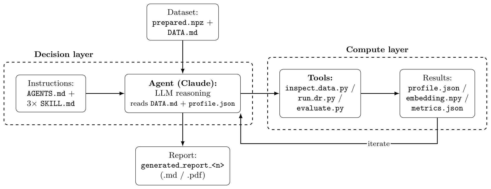
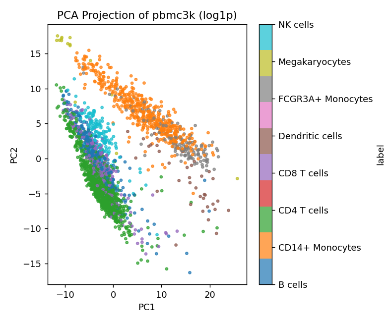
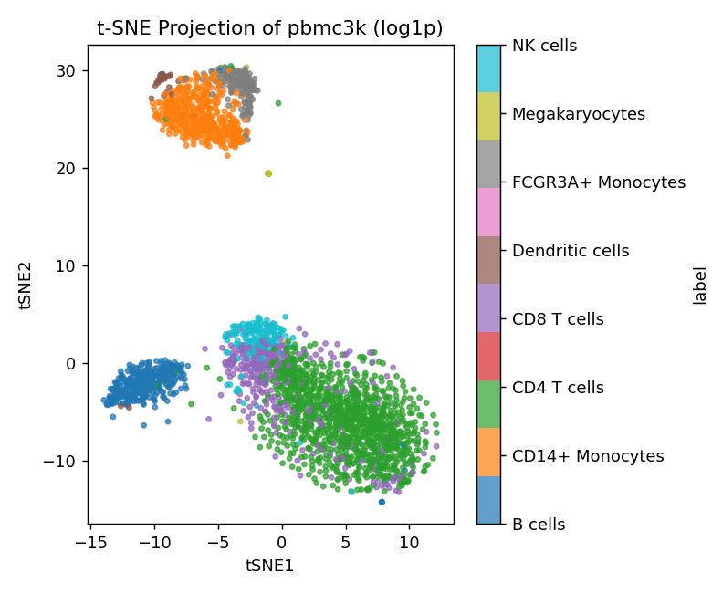

---
output:
  pdf_document: default
  html_document: default
editor_options: 
  markdown: 
    wrap: sentence
---

# Building an AI Agent for Dimension Reduction and Exploratory Data Analysis

## 1. System Architecture Overview

Dimension reduction (DR) — from traditional linear methods like PCA to nonlinear ones like UMAP, t-SNE, and diffusion maps — is a very practical tool for exploring high-dimensional data such as single-cell gene expression or biomedical images. However no single method or preprocessing choice works universally across datasets: the right decision depends on a dataset's sparsity, scale heterogeneity, underlying structure, and has traditionally required a human analyst's judgment. This project investigates replacing that judgment with an AI agent: specifically, a large language model (LLM) that inspects each dataset, selects and justifies its own preprocessing and DR method choices based on the evidence it observes, runs and evaluates the resulting embeddings, and reports its findings. The agent design for this project is inspired by Lecture 9 - AI agents. The overall system architecture is summarized below and in Figure 1. 

**Decision layer** (the Agent + Instructions boxes in Figure 1): 
`AGENTS.md` defines the overall workflow for the agent and `.agents/skills/{preprocessing,method-selection,evaluation}/SKILL.md` encode the *criteria* for each decision as a reasoning framework, NOT a lookup table. The agent reads a dataset's `DATA.md` and `profile.json`, applies the relevant skill, and produces a justified `--preprocessing`/`--method`/`--params` choice, iterating with the tools (the feedback loop in Figure 1) before writing the final report.

**Compute layer** (`tools/`, no decision logic — the Tools/Results boxes in Figure 1): `inspect_data.py` profiles a dataset and writes `profile.json`; `run_dr.py` applies one of 4 preprocessing modes and fits one of 9 DR methods, writing `embedding.npy`, `plot.png`, `run_config.json`; `evaluate.py` computes trustworthiness and silhouette scores, writing `metrics.json`.

Two key rules keep this architecture maintainable: (1) `tools/*.py` may never contain a dataset-specific branch — all dataset-specific reasoning lives in the agent's decisions and in `prepare.py`; (2) every reported number must come from a persisted artifact (`profile.json`, `run_config.json`, `metrics.json`), never from the agent's recollection of a prior run.

## 2. Agent Decision-Making

Broadly, the agent has to make a decision during the following three stages: data pre-processing, dimension reduction method selection, and evaluation of results. 

**Preprocessing** is chosen from `profile.json`'s quantitative signals against the preprocessing skill's rules — e.g. high sparsity with a wide value range indicates count data (→ `log1p`), while a feature-scale ratio near 1 across features sharing one physical unit (e.g., image pixel intensities) means standardization is a real tradeoff, not a default. The choice is checked empirically where the profiler can't fully resolve it. For instance, for pbmc3k, before committing to `log1p` alone, the agent verified that standardizing all 16,579 genes would inflate thousands of near-silent, dropout-noise genes to unit variance and measured how much this diluted PCA's variance concentration (15.3% vs. 2.0% in the top 2 components) before ruling it out.

**Method selection** is framed around *what relationship a method preserves* — global variance, local-linear structure, graph connectivity, diffusion geometry, or pure visualization — rather than a fixed per-dataset recipe. The `.agents/skills/method-selection` SKILL.md only gives general decision guidance. The skill encodes hard constraints (e.g., methods requiring a dense n×n matrix such as MDS, Kernel PCA, and Isomap are ruled out above roughly tens of thousands of samples on architectural grounds since such a matrix at n about 90,000 is about \~65GB) and a complexity-based rule for sizing any subsample is forced so that the same reasoning holds regardless of which machine runs it.

**Evaluation** uses two complementary metrics: trustworthiness (label-free neighborhood fidelity, calibrated 0.7–0.9 as "acceptable for visualization") and a silhouette *gap* — embedding-space silhouette minus input-space silhouette — benchmarked against PCA's own gap on the same data.
This second metric is used specifically to distinguish "this method reveals real class separation" from "this method's objective function pulls groups apart regardless of the underlying data," a distinction that was heavily emphasized during the tSNE & UMAP visualization lectures. For instance, the *All of Us* study's UMAP plot colored by self-identified race, widely misread as evidence of discrete genetic clusters it could not support.

**NOTE**: The agent's decision process is LLM reasoning over evidence, not a deterministic program. For instance, during the agent's refinement process, independent invocations of the identical workflow on the identical pbmc3k dataset have selected different DR method combinations over this project's development — see §5.

## 3. Tools and Models

**Language model**: Claude Sonnet 5 (via Claude Code) performs all analytical decision-making (preprocessing/method selection, metric interpretation) and created the AI reports. No other model makes decisions; this is distinct from —

**The DR methods themselves**, which are statistical/ML models fit to data by the compute layer: scikit-learn (`PCA`, `KernelPCA`, `MDS`, `Isomap`, `LocallyLinearEmbedding`, `SpectralEmbedding`, `TSNE`, `trustworthiness`, `silhouette_score`), `umap-learn`, and a from-scratch NumPy/SciPy **Diffusion Map** implementation (sparse k-NN Gaussian affinities, `alpha`-density normalization per Coifman & Lafon 2006, sparse eigendecomposition via `eigsh`).

**Data acquisition** is dataset-specific and isolated to each `prepare.py`: `scanpy` (pbmc3k raw counts, plus its officially annotated tutorial companion dataset for real cell-type ground truth) and `medmnist` (PathMNIST images and labels).

**Supporting tools**: `numpy`/`pandas` for data handling, `matplotlib` for plotting, `pandoc`/`typst` for PDF export of final reports. All dependency versions are pinned in `requirements.txt` to the exact versions verified during development.

## 4. Experimental Results

*(NOTE: Additional runs, full hyperparameters, and metric tables for every method tried are in `generated_report_1.md` and `generated_report_2.md`; this section highlights the baseline-vs-featured-method comparison for each dataset.)*

|   | PBMC3K | PathMNIST |
|------------------------|------------------------|------------------------|
| Size | 2,638 cells × 16,579 genes | 89,996 patches × 2,352 pixels |
| Labels | 8 real cell types (scanpy tutorial annotation), highly imbalanced (15–1,144 per class) | 9 tissue classes, roughly balanced |
| Preprocessing | `log1p` (count data, dropout-noise argument) | `none` (homogeneous [0,255] scale) |
| Trustworthiness range | 0.78–0.83 (acceptable) | 0.80–0.83 (acceptable) |
| Silhouette gap vs. PCA baseline | 20–27× larger for UMAP/t-SNE | about 1× (no larger than PCA's) |

The agent was tested on two very different datasets: PBMC3K and PathMNIST. On PBMC3K, PCA alone captures very little structure — PC1 and PC2 together explain only 15.3% of variance — consistent with most of the 16,579-gene space being dropout noise rather than signal. Given the dataset's discrete, highly uneven cell populations (15 to 1,144 cells per type), the agent selected t-SNE (perplexity 30) as its featured method. Consistent with this choice, nonlinear visualization methods consistently found substantially more label-consistent structure than PCA: t-SNE reached the highest trustworthiness of the three methods tried, 0.805 (vs. UMAP's 0.796 and PCA's 0.784), though its much larger silhouette gap over PCA's baseline (+0.247 vs. +0.009) tells us that gap reflects method-driven visual separation more than proportionally large biological distance. No method resolved closely related subtypes (e.g., CD4 vs. CD8 T cells).

{width=48%} {width=48%}

**Figure 2**: PBMC3K — PCA baseline (left) vs. the featured t-SNE embedding (right), colored by real cell type. The lymphoid/myeloid split PCA finds is preserved and sharpened by t-SNE, which additionally separates several finer cell types PCA leaves overlapping.

On PathMNIST, PCA's first two components explain more variance in absolute terms (56.9%: PC1 = 54.6%, PC2 = 2.3%) but for the wrong reason: PC1 correlates almost perfectly with each patch's mean pixel intensity (|r| = 0.999), implying the dominant linear axis is overall image brightness rather than tissue identity. The agent selected UMAP (`n_neighbors = 30`) as its featured method, both because it was the only one of the three methods run that scales to the full 89,996-patch dataset without subsampling, and because the enlarged neighborhood size was chosen to let class-level organization, rather than fine per-patch texture, shape the layout. UMAP reached a trustworthiness of 0.812, but its silhouette gap over PCA's baseline was negligible (about 1×, no larger than PCA's own) — consistent with the fact that *no* method, linear or nonlinear, found tissue-class structure beyond what a linear projection already failed to find. One hypothesis is that flattening a 28×28 patch destroys the spatial/textural information that actually distinguishes tissue types.

{width=48%} {width=48%} 

**Figure 3**: PathMNIST — PCA baseline (left) vs. the featured UMAP embedding (right), colored by tissue class. Both are dominated by the same brightness axis rather than tissue identity; UMAP reshapes the layout but does not separate the classes any better than PCA does.

## 5. Strengths and limitations

**Strengths** - The system's clearest strength is its autonomy: given a new dataset, it decides how to prepare it and which methods to try without a human needing to make those calls, which could make it a genuinely useful first-pass tool for an analyst exploring new data. It's also easy to grow — a brand-new method can be added to its toolkit without changing any of the surrounding code, so it isn't locked into a fixed set of techniques. Under the hood, the actual number-crunching is kept separate from the AI's decision-making, and was confirmed to produce identical results even after wiping its cache and starting completely fresh. Also, small conveniences like showing real category names instead of numbers on a plot, are used automatically when a dataset provides them, but nothing breaks when it doesn't.

**Limitations** - The system's biggest limitation is that its own decision-making isn't always consistent: asking it to redo the exact same analysis on the exact same data can lead it to pick a different combination of DR methods each time, since it's reasoning through the choice rather than following a fixed rule — the overall conclusions stayed the same across reruns however. It's also limited in how it can prepare data going in: it only offers four generic preparation options, so for instance it can't do things like the specialized normalization steps a human analyst would typically use for gene-expression data, or extract visual features from images before analyzing them, meaning some approaches that would need more sophisticated preparation simply aren't available. Similarly, a few analysis methods that need to compare every data point against every other point (i.e., MDS, Kernel PCA, Isomap) were left out entirely for the larger dataset, since doing so would require far more memory (~100GB) than any reasonable computer has. 

## References

1.  L. van der Maaten and G. Hinton, "Visualizing Data using t-SNE," *JMLR*, 2008.
2.  L. McInnes, J. Healy, and J. Melville, "UMAP: Uniform Manifold Approximation and Projection," 2018.
3.  R. R. Coifman and S. Lafon, "Diffusion Maps," *Applied and Computational Harmonic Analysis*, 2006.
4.  F. A. Wolf, P. Angerer, and F. J. Theis, "SCANPY: large-scale single-cell gene expression data analysis," *Genome Biology*, 2018.
5.  J. Yang et al., "MedMNIST v2 — A large-scale lightweight benchmark for 2D and 3D biomedical image classification," *Scientific Data*, 2023.
6.  Pedregosa et al., "Scikit-learn: Machine Learning in Python," *JMLR*, 2011.
